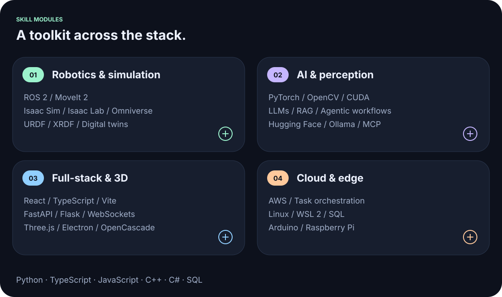
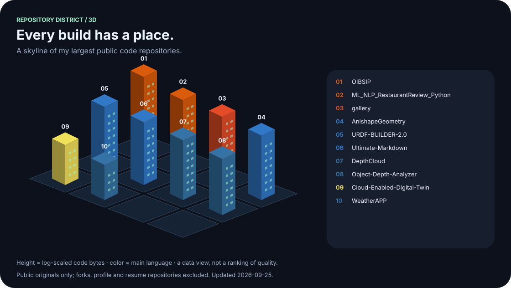
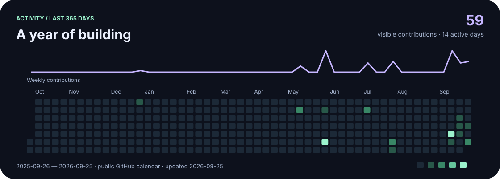
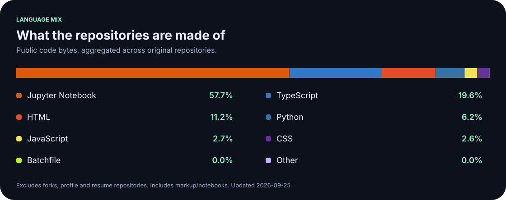
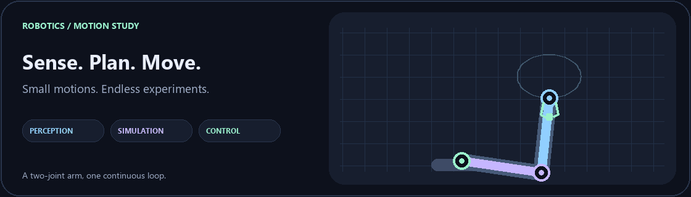

# Hi, I'm Shiwam.

### Robotics · AI · Full-stack engineering

I build software that connects what machines **see**, how they **move**, and how people **work with them**.

&nbsp;

&nbsp;

 

## A little about what I build

My work sits between **robotics and software**: perception pipelines, digital twins, simulation tools, and interfaces that make complex systems easier to use. I enjoy taking an idea through the whole stack—from a Python service or a robot model to a responsive 3D workspace.

I'm especially interested in **physical AI**, local computer vision, and AI agents connected to useful tools. That usually means working across ROS, NVIDIA simulation, model inference, real-time communication, and web applications—with plenty of debugging between them.

> Currently exploring better object reconstruction, more usable robot-authoring tools, and the connection between CAD, perception, and simulation.

## My engineering toolkit

<strong>Open the full stack</strong>

| Area | Tools I work with |
| :--- | :--- |
| **Robotics & simulation** | ROS 1 / ROS 2, MoveIt 2, NVIDIA Isaac Sim, Isaac Lab, Omniverse Kit, URDF / XRDF, digital twins |
| **AI & perception** | PyTorch, TensorFlow, scikit-learn, OpenCV, CUDA, Hugging Face, LLMs, RAG, LangChain, Ollama, OpenAI API, MCP |
| **Full-stack & 3D** | React, Vite, FastAPI, Flask, Electron, Three.js, React Three Fiber, OpenCascade WASM, REST APIs, WebSockets |
| **Cloud & data** | AWS EC2, S3, SQS, Lambda, API Gateway, IAM, MySQL, SQLite |
| **Edge & engineering** | Arduino, Raspberry Pi, Linux, WSL 2, Git, Blender, Unity, Fusion 360 |
| **Code** | Python, TypeScript, JavaScript, C++, C#, SQL, HTML / CSS |

## Things I've been building

<table>
<tr>
<td width="50%" valign="top">
<h3>◉ DepthCloud</h3>

A local webcam reconstruction studio: collect steady views, align cameras, inspect an estimated 3D surface.

<code>Python</code> <code>Computer vision</code> <code>Three.js</code>

<a href="https://github.com/shiwamshoryasharma/DepthCloud">Explore the reconstruction studio →</a>
</td>
<td width="50%" valign="top">
<h3>⌘ URDF Builder 2.0</h3>

A desktop workbench for authoring, validating, and visualizing robot models with synchronized XML and 3D views.

<code>Electron</code> <code>TypeScript</code> <code>Robotics</code>

<a href="https://github.com/shiwamshoryasharma/URDF-BUILDER-2.0">Open the robot workbench →</a>
</td>
</tr>
<tr>
<td width="50%" valign="top">
<h3>◇ AnishapeGeometry</h3>

Parametric CAD with sketch constraints, editable feature history, solid modeling, and STEP/STL export.

<code>OpenCascade</code> <code>WebAssembly</code> <code>CAD</code>

<a href="https://github.com/shiwamshoryasharma/AnishapeGeometry">Explore the geometry tools →</a>
</td>
<td width="50%" valign="top">
<h3>▤ Ultimate Markdown</h3>

A document workspace for live Markdown editing, linked files, rich media, and flexible export workflows.

<code>React</code> <code>TypeScript</code> <code>Developer tools</code>

<a href="https://github.com/shiwamshoryasharma/Ultimate-Markdown">Open the writing workspace →</a>
</td>
</tr>
</table>

Also exploring perception with [Object Depth Analyzer](https://github.com/shiwamshoryasharma/Object-Depth-Analyzer).

## The repository district

## In the commit stream

Cards refresh daily. Language shares describe repository contents, not proficiency or time spent coding. The profile-view counter is an approximate badge-load count, not unique visitors.

## Away from the keyboard… sometimes

| 🎮 Play | 🌌 Watch | 🎧 Listen |
| :--- | :--- | :--- |
| PC & console gaming | Anime and sci-fi movies | Music and songs in every language |

A little spoken Japanese has made its way into my vocabulary. Credit goes mostly to anime.

<strong>After-hours anime taste · 18+ spoiler</strong>

Yes, I also enjoy hentai. That's the spoiler.

 

**Good tools make room for curiosity.**

Robots to understand. Worlds to build. Games to finish.

[Repositories](https://github.com/shiwamshoryasharma?tab=repositories) · [ORCID](https://orcid.org/0009-0005-9798-8856)

